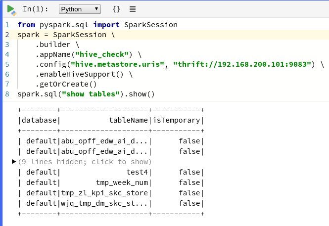

# polynote
## 安装
```
# 依赖包
pip3 install jep jedi pyspark virtualenv
# 安装包
tar -zxvpf polynote-dist.tar.gz
cd polynote

```
## 使用
```
# 启动
./polynote.py
#访问：
http://127.0.0.1:8192/
```
笔记设置中配置：spark.master local[*]
1. pyspark

2. scala 

3. sparksql
需要将要连接的hive-site.xml放到本地spark的conf目录下