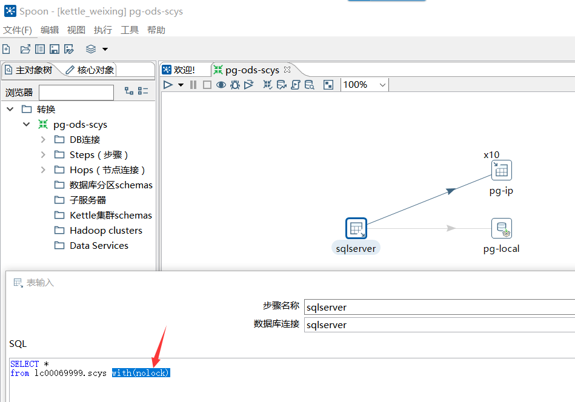

# 伟星大数据维护操作步骤
## 1、erp表ETL
连接到数据库资源库：
windows电脑打开spoon.bat（7.0版本），如下图：

选择kettle_weixing，输入密码admin进入
打开一个转换，如

### etl到postgre

### etl到greenplum

## 2、greenplum中存储过程
## 3、推送结果表到postgre
## 4、kettle调度所有任务
## 5、crontab定时运行kettle作业
